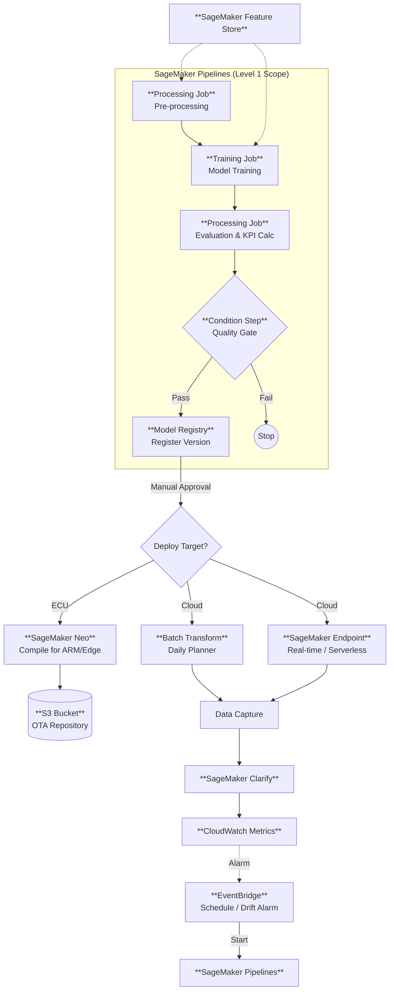

# MLOps アーキテクチャ設計書：EVバッテリー劣化抑制ソリューション (PoC)

**Version:** 1.0  
**Status:** Draft (PoC Phase)  
**Target Maturity Level:** Level 1 (ML Pipeline Automation)

---

## 1. MLOpsの定義と目的

### 概要
MLOps (Machine Learning Operations) とは、機械学習システムの開発（Dev）と運用（Ops）を統合し、長期間にわたり安定的かつ高品質なMLモデルを提供し続けるための実践手法です。
本プロジェクトでは、「EVバッテリー」という物理的な経年劣化や、ユーザーごとの多様な使用環境（気温、充電習慣など）に適応するため、モデルを一度作って終わりにするのではなく、**継続的に育て続ける基盤**としてMLOpsを導入します。

### 本プロジェクトにおける目的
1.  **予測精度の維持 (Sustained Performance)**
    * 季節変化やバッテリー劣化進行に伴う「データドリフト」を検知し、常に最新の傾向を学習したモデルを提供する。
2.  **運用工数の削減 (Operational Efficiency)**
    * 手動での再学習・評価・変換作業を廃止し、エンジニアが「モデルの改善」に集中できる環境を作る。
3.  **説明責任とコンプライアンス (Accountability)**
    * 「なぜ充電スキップを推奨したか」の推論根拠と、学習に使用したデータセットのトレーサビリティを確保する。

---

## 2. MLOps 成熟度モデルとターゲット

本設計では、業界標準として広く参照される **Google Cloud の MLOps 成熟度モデル** を採用します。また、信頼性を補強するために Microsoft の定義も参照しています。

### 採用する成熟度モデル
* **Source 1 (Main):** [Google Cloud - MLOps: 機械学習における継続的デリバリーと自動化のパイプライン](https://cloud.google.com/architecture/mlops-continuous-delivery-and-automation-pipelines-in-machine-learning?hl=ja)
* **Source 2 (Ref):** [Microsoft - Machine Learning Operations (MLOps) maturity model](https://learn.microsoft.com/en-us/azure/architecture/ai-ml/guide/mlops-maturity-model)

### 各レベルの定義と本PoCのスコープ

| Level | 名称 | 定義 | 本プロジェクトでの位置づけ |
| :--- | :--- | :--- | :--- |
| **Level 0** | **手動プロセス** | データ抽出、学習、モデル評価、デプロイが完全に手動。スクリプト駆動。 | **現状 (As-Is)**。初期のモデル探索フェーズ。 |
| **Level 1** | **MLパイプラインの自動化** | **今回のPoCターゲット (To-Be)**。学習データの到着やスケジュールをトリガーに、学習〜モデル登録までが自動実行される。CT (Continuous Training) の実現。 |
| **Level 2** | **CI/CDパイプラインの自動化** | パイプライン自体のコード変更に対する自動テストとデプロイ。数千台規模への高速リリース基盤。 | **次期スコープ (Future)**。商用化フェーズで実装。 |

---

## 3. MLOps アーキテクチャ構成図

### 3-1. 全体概念図

```mermaid
graph LR
    %% Data Phase
    Data[データ基盤 (S3)] -->|Extract| Process[前処理]
    
    %% Training Phase (CT)
    subgraph ML_Pipeline [MLパイプライン (Auto)]
        Process --> Train[モデル学習]
        Train --> Eval[評価・検証]
        Eval -->|Gate Check| Register[モデル登録]
    end
    
    %% Deployment Phase (Hybrid)
    Register -->|Approve| Deploy_Cloud[クラウド環境]
    Register -->|Approve| Deploy_Edge[ECU環境]
    
    %% Monitoring
    Deploy_Cloud & Deploy_Edge --> Monitor[監視・ドリフト検知]
    Monitor -->|Feedback| ML_Pipeline
```

### 3-2. AWSサービス詳細構成図



---

## 4. PoC実装ロードマップ (MVPアプローチ)

スクラム開発における **MVP (Minimum Viable Product)** の考え方を適用し、「コア機能」から順に実装・検証を進めます。一度に全てを作るのではなく、各フェーズで動くものを作ります。

### MVP 1: The "Walking Skeleton" (動く骨格)
* **目的:** パイプラインが「端から端まで」通ることの確認。
* **実装内容:**
    * 固定のS3データ(CSV)を入力とする。
    * SageMaker Pipelines で「前処理 → 学習 → モデル登録」だけの単純なフローを構築。
    * 評価や条件分岐は省略（常に登録）。
* **検証:** コードを実行すると、Model Registryにモデルが登録されること。

### MVP 2: The "Quality Gate" (品質の担保)
* **目的:** 悪いモデルが登録されない仕組み（Condition Step）の実装。
* **実装内容:**
    * **評価ステップ**を追加。RMSEや「充電不足率」を計算。
    * **条件分岐 (Condition Step)** を追加。基準未達ならストップ。
    * **Feature Store** を導入し、学習データ管理を一元化。
* **検証:** 精度が悪いモデルが自動的に拒否されること。

### MVP 3: The "Hybrid Deployer" (推論と最適化)
* **目的:** クラウドとECU、それぞれの形式で出力できること。
* **実装内容:**
    * **Batch Transform** の設定（クラウド推論）。
    * **SageMaker Neo** またはコンテナ内処理による **ONNX変換/量子化** の実装（ECU推論）。
    * S3へのアーティファクト配置。
* **検証:** S3に配置されたONNXモデルが、ローカルPC等の推論エンジンで読み込めること。

### MVP 4: The "Watchtower" (監視と説明性)
* **目的:** 運用フェーズのシミュレーション（ドリフト検知）。
* **実装内容:**
    * **SageMaker Clarify** をパイプラインに組み込み、バイアス検知を設定。
    * Model Monitor を設定し、意図的にデータをずらして **CloudWatch Alarm** を発報させる。
* **検証:** データ分布の変化を検知し、EventBridge経由でパイプラインが再起動すること。

---

## 5. 実際の運用時に決定・検討すべき事項

PoC中に以下のパラメータやルールを確定させます。

| カテゴリ | 決定事項 | 検討のポイント |
| :--- | :--- | :--- |
| **トリガー戦略** | 再学習の頻度 | 毎週月曜AM2時とするか？データドリフト検知時のみとするか？（コスト対効果で判断） |
| **モデル評価** | デプロイ判定閾値 | RMSE < 5.0 かつ ビジネスKPI（欠損率） < 1.0% など、具体的な数値を過去データから算出。 |
| **ECU制約** | モデルサイズ・形式 | チップセット（Renesas/Nvidia等）に依存。許容サイズ（例: 5MB）と推論時間（100ms）の上限。 |
| **承認フロー** | Human-in-the-loop | 自動デプロイのリスク回避。誰が（PM? データサイエンティスト?）承認ボタンを押す権限を持つか。 |
| **コスト管理** | インスタンス選定 | 学習ジョブ（ml.m5.xlarge等）と推論ジョブのスペック選定。スポットインスタンス利用可否。 |

---

## 6. 今回のPoCにおける検証スコープ

| 対象 (Scope In) | 対象外 (Scope Out) |
| :--- | :--- |
| ✅ **完全自動化**: データ入力〜モデル登録〜配布用S3配置までの無人化。 | ❌ **OTA配信**: S3以降、実車に届くまでの通信経路。 |
| ✅ **ECU変換検証**: ONNX/TFLiteへの変換成功率とサイズ削減率の測定。 | ❌ **実機検証**: 実車ECU上での厳密な動作テスト（PC上のエミュレーションまで）。 |
| ✅ **ドリフト検知**: データ分布変化時のアラート発報と自動再学習トリガー。 | ❌ **オンライン学習**: リアルタイムに重みを更新する学習手法（バッチ学習のみ）。 |
| ✅ **マルチ推論**: バッチ推論 vs サーバーレス推論のコスト・性能比較。 | ❌ **CI/CD**: パイプラインコード自体の自動テスト・デプロイ機構。 |

---

## 7. 参考資料 (Sources)

情報の信頼性を担保するため、以下の公式ドキュメントおよび技術ガイドラインに基づき設計されています。

1.  **Google Cloud Architecture Center**: "MLOps: Continuous delivery and automation pipelines in machine learning"  
    <https://cloud.google.com/architecture/mlops-continuous-delivery-and-automation-pipelines-in-machine-learning>
2.  **AWS Whitepaper**: "Machine Learning Lens - AWS Well-Architected Framework"  
    <https://docs.aws.amazon.com/wellarchitected/latest/machine-learning-lens/machine-learning-lens.html>
3.  **Microsoft Azure Architecture**: "Machine Learning Operations (MLOps) maturity model"  
    <https://learn.microsoft.com/en-us/azure/architecture/ai-ml/guide/mlops-maturity-model>
4.  **NeurIPS Paper (Concept)**: "Hidden Technical Debt in Machine Learning Systems" (Sculley et al.)  
    <https://papers.nips.cc/paper/2015/file/86df7dcfd896fcaf2674f757a2463eba-Paper.pdf>
